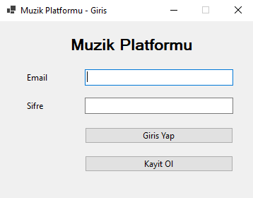
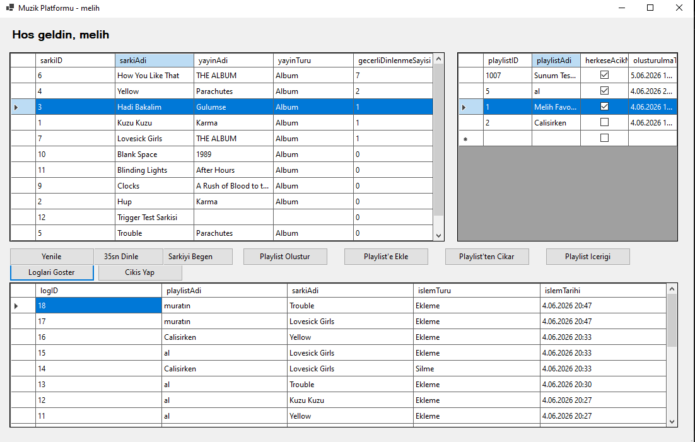
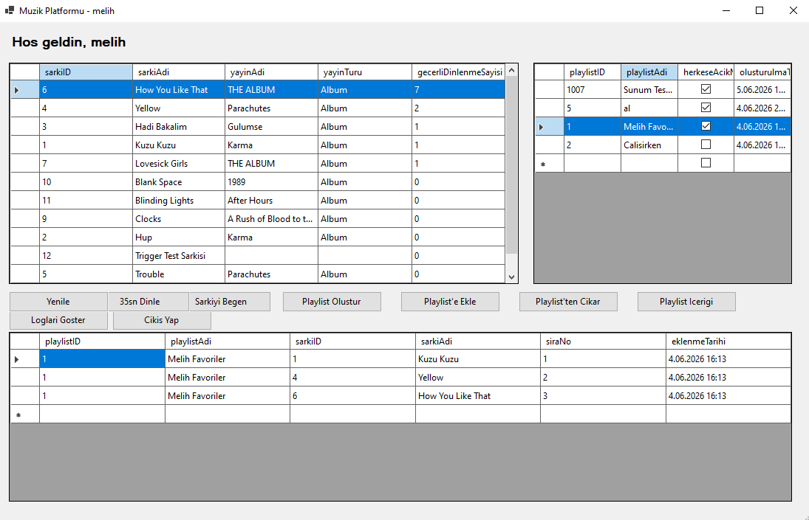
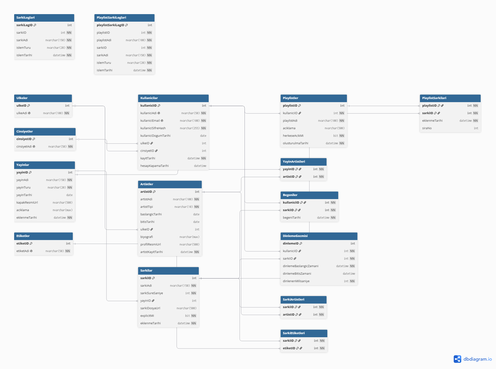

# Muzik Dinleme Platformu Veritabani Projesi

## Proje Ozeti

Bu proje, bir muzik dinleme platformunun temel veritabani yapisini ve basit bir masaustu arayuzunu modellemek icin gelistirilmistir. Sistem kullanici girisi, sarki listeleme, playlist olusturma, playlist'e sarki ekleme/cikarma, sarki begenme ve dinleme kaydi olusturma islemlerini destekler.

Proje kapsaminda SQL Server uzerinde iliskisel veritabani tasarlanmis; tablo, constraint, index, view, trigger ve stored procedure yapilari kullanilmistir. Ayrica C# Windows Forms ile temel islemleri gosteren basit bir arayuz gelistirilmistir.

## Problem Tanimi

Muzik dinleme uygulamalarinda kullanicilarin sarki dinleme, begenme ve playlist olusturma davranislari sistemli bicimde saklanmalidir. Sarkilarin sanatcilar, yayinlar ve etiketlerle iliskileri de coktan coga yapida olabilecegi icin normalizasyon kurallarina uygun bir veritabani tasarimi gereklidir.

Bu projede amac, muzik platformundaki temel varliklari ve kullanici etkilesimlerini iliskisel veritabani mantigiyla modellemek ve bu model uzerinden raporlama/test islemleri yapabilmektir.

## Gelistirme Ortami

- Veritabani: Microsoft SQL Server / SQL Server Express
- Veritabani yonetimi: SQL Server Management Studio
- Programlama dili: C#
- Arayuz: Windows Forms
- Framework: .NET 8.0 Windows
- SQL istemci paketi: Microsoft.Data.SqlClient

## Kurulum ve Calistirma

1. SQL Server Management Studio uzerinden SQL Server'a baglanin.
2. `grupno_sql_betikleri_birlesik.txt` dosyasindaki SQL betigini calistirin.
3. Betik; veritabanini, tablolari, constraintleri, indexleri, viewleri, triggerlari, procedureleri ve dummy datalari olusturur.
4. Windows Forms uygulamasi icin `MuzikPlatformuApp` projesini acin.
5. `Db.cs` dosyasindaki connection string degerinin kendi SQL Server instance adinizla uyumlu oldugunu kontrol edin.
6. Uygulamayi Visual Studio veya terminal uzerinden calistirin.

Terminal ile calistirma:

```powershell
cd MuzikPlatformuApp
dotnet run
```

Publish edilmis exe dosyasi:

```text
MuzikPlatformuApp/publish/MuzikPlatformuApp.exe
```

## Veritabani Tablolari

Projede kullanilan temel tablolar:

- `Ulkeler`
- `Cinsiyetler`
- `Kullanicilar`
- `Artistler`
- `Yayinlar`
- `YayinArtistleri`
- `Sarkilar`
- `SarkiArtistleri`
- `Etiketler`
- `SarkiEtiketleri`
- `Playlistler`
- `PlaylistSarkilari`
- `Begeniler`
- `DinlemeGecmisi`
- `SarkiLoglari`
- `PlaylistSarkiLoglari`

## Iliski Yapisi

Temel iliskiler:

- `Ulkeler 1 - N Kullanicilar`
- `Ulkeler 1 - N Artistler`
- `Cinsiyetler 1 - N Kullanicilar`
- `Artistler N - N Yayinlar`
- `Yayinlar 1 - N Sarkilar`
- `Artistler N - N Sarkilar`
- `Sarkilar N - N Etiketler`
- `Kullanicilar 1 - N Playlistler`
- `Playlistler N - N Sarkilar`
- `Kullanicilar N - N Sarkilar`
- `Kullanicilar 1 - N DinlemeGecmisi`
- `Sarkilar 1 - N DinlemeGecmisi`

Coktan coga iliskiler ara tablolar ile cozulmustur. Ornegin `PlaylistSarkilari`, playlist ile sarki arasindaki iliskiyi tutar ve iliskiye ait `eklenmeTarihi` ve `siraNo` bilgilerini saklar.

## Normalizasyon ve Tasarim Kararlari

- Sarki etiketleri tek hucrede virgulle tutulmamistir. Bunun yerine `Etiketler` ve `SarkiEtiketleri` tablolari kullanilmistir.
- Bir sarkinin birden fazla sanatcisi olabilecegi icin `SarkiArtistleri` ara tablosu olusturulmustur.
- Album, single ve EP yapilari `Yayinlar` tablosunda `yayinTuru` alaniyla tutulmustur.
- Yayinin birden fazla sanatcisi olabilecegi icin `YayinArtistleri` ara tablosu kullanilmistir.
- Yas ayri bir kolon olarak tutulmamistir; `kullaniciDogumTarihi` uzerinden hesaplanabilir.
- Dinlenme sayisi `Sarkilar` tablosunda tutulmamistir. Her dinleme olayi `DinlemeGecmisi` tablosuna kaydedilir ve toplam dinlenme sayisi sorgularla hesaplanir.
- Begeni sayisi ayri tutulmamistir. `Begeniler` tablosundaki kayitlar sayilarak hesaplanir.
- Dinleme islemleri zaten olay bazli olarak `DinlemeGecmisi` tablosunda tutuldugu icin ayrica `DinlemeLoglari` tablosu acilmamistir.
- Premium/free abonelik modeli kapsam disi birakilmistir. Proje odagi muzik verileri, kullanici etkilesimleri ve veritabani iliskileridir.

## Constraint Kullanimi

Projede veri butunlugunu saglamak icin su constraint turleri kullanilmistir:

- Primary Key
- Foreign Key
- Unique
- Check
- Default

Ornekler:

- `Kullanicilar.kullaniciEmail` unique olarak tanimlanmistir.
- `Sarkilar.sarkiSureSaniye > 0` check constraint ile kontrol edilir.
- `Artistler.artistTipi` yalnizca `Solo` veya `Grup` olabilir.
- `Yayinlar.yayinTuru` yalnizca `Album`, `Single` veya `EP` olabilir.
- `DinlemeGecmisi.dinlenenMilisaniye > 0` olmalidir.
- Tarih alanlarinda bitis tarihi baslangic tarihinden once olamaz.
- Kayit tarihleri ve eklenme tarihleri icin `GETDATE()` default olarak kullanilmistir.

## Indexler

Kullanilan indexler:

- `IX_Sarkilar_sarkiAdi`
- `IX_Artistler_artistAdi`
- `IX_DinlemeGecmisi_sarkiID`
- `IX_DinlemeGecmisi_kullaniciID`
- `IX_Playlistler_kullaniciID`

Indexler her foreign key alanina ezbere eklenmemistir. Arama ve raporlama acisindan anlamli kolonlar secilmistir.

## Viewler

Kullanilan viewler:

- `vw_SarkiDetaylari`
- `vw_PlaylistDetaylari`
- `vw_GecerliDinlenmeSayilari`

`vw_GecerliDinlenmeSayilari`, 30 saniye ve uzeri dinlemeleri gecerli dinlenme olarak sayar.

## Triggerlar

Kullanilan triggerlar:

- `trg_Sarkilar_Insert_Log`
- `trg_Sarkilar_Delete_Log`
- `trg_PlaylistSarkilari_Insert_Log`
- `trg_PlaylistSarkilari_Delete_Log`

Triggerlar loglama amaciyla kullanilmistir. Sarki ekleme/silme ve playlist'e sarki ekleme/cikarma islemlerinde log tablolarina otomatik kayit atilir.

## Stored Procedureler

Kullanilan stored procedureler:

- `sp_KullaniciGiris`
- `sp_PlaylistOlustur`
- `sp_PlaylisteSarkiEkle`
- `sp_SarkiBegen`

Procedureler, arayuzdeki temel kullanici islemlerini veritabani tarafinda standartlastirmak icin kullanilmistir. Ozellikle `sp_PlaylisteSarkiEkle`, playlist ve sarki varlik kontrolu, tekrar ekleme kontrolu, otomatik sira numarasi belirleme ve transaction yonetimi icerir.

## Arayuz Ozeti

Windows Forms arayuzunde bulunan temel ozellikler:

- Kullanici girisi
- Yeni kullanici kaydi
- Sarki listeleme
- 35 saniyelik dinleme simule etme
- Sarki begenme
- Playlist olusturma
- Playlist adini degistirme
- Playlist'e sarki ekleme
- Playlist'ten sarki cikarma
- Playlist icerigini goruntuleme
- Loglari goruntuleme
- Cikis yapma

Arayuzdeki butonlarin bir kismi stored procedureleri cagirir. Listeleme ve gosterme islemlerinde viewler ve SELECT sorgulari kullanilmistir.

## Ekran Goruntuleri

Giris ekrani:



Ana ekran ve log gorunumu:



Playlist icerigi gorunumu:



Veritabani ER diyagrami:



## Test Verileri

Veritabani tablolarina gercege yakin dummy data eklenmistir. Cinsiyetler tablosu sabit referans tablo olarak dusunuldugu icin yapay olarak 10 degere tamamlanmamistir. Diger ana tablolar ve iliski tablolarinda test sorgulari, viewler, triggerlar ve procedureler calisacak sekilde veri bulunmaktadir.

## Ornek Test Sorgusu

Asagidaki sorgu sarkilarin yayin, artist, etiket, dinlenme, begeni ve playlist bilgilerini birlikte raporlar:

```sql
SELECT
    s.sarkiID,
    s.sarkiAdi,
    y.yayinAdi,
    y.yayinTuru,
    COUNT(DISTINCT sa.artistID) AS artistSayisi,
    COUNT(DISTINCT se.etiketID) AS etiketSayisi,
    COUNT(DISTINCT CASE
        WHEN dg.dinlenenMilisaniye >= 30000 THEN dg.dinlemeID
    END) AS gecerliDinlenmeSayisi,
    COUNT(DISTINCT b.kullaniciID) AS begeniSayisi,
    COUNT(DISTINCT ps.playlistID) AS bulunduguPlaylistSayisi
FROM Sarkilar s
LEFT JOIN Yayinlar y ON s.yayinID = y.yayinID
LEFT JOIN SarkiArtistleri sa ON s.sarkiID = sa.sarkiID
LEFT JOIN SarkiEtiketleri se ON s.sarkiID = se.sarkiID
LEFT JOIN DinlemeGecmisi dg ON s.sarkiID = dg.sarkiID
LEFT JOIN Begeniler b ON s.sarkiID = b.sarkiID
LEFT JOIN PlaylistSarkilari ps ON s.sarkiID = ps.sarkiID
GROUP BY
    s.sarkiID,
    s.sarkiAdi,
    y.yayinAdi,
    y.yayinTuru
ORDER BY
    gecerliDinlenmeSayisi DESC,
    begeniSayisi DESC;
```

## Akis Semasi

Temel kullanim akisi:

```text
Kullanici giris yapar
-> Sarkilar listelenir
-> Kullanici sarki dinleyebilir
-> Dinleme kaydi DinlemeGecmisi tablosuna eklenir
-> Kullanici sarki begenebilir
-> Kullanici playlist olusturabilir
-> Playlist'e sarki ekleyebilir veya cikarabilir
-> Triggerlar ilgili log tablolarina kayit atar
```

## Yazilim Mimarisi

Uygulama basit katmanli bir yapiya sahiptir:

- SQL Server: Veritabani, tablolar, viewler, triggerlar ve procedureler
- C# Windows Forms: Kullanici arayuzu
- `Db.cs`: Veritabani baglantisi ve sorgu/procedure calistirma yardimci sinifi
- `LoginForm`: Giris ve kayit islemleri
- `MainForm`: Ana uygulama islemleri
- `RegisterForm`: Yeni kullanici kaydi

## Referanslar

- Microsoft SQL Server Documentation
- Microsoft SQL Server Management Studio Documentation
- Microsoft .NET Windows Forms Documentation
- Microsoft.Data.SqlClient Documentation
